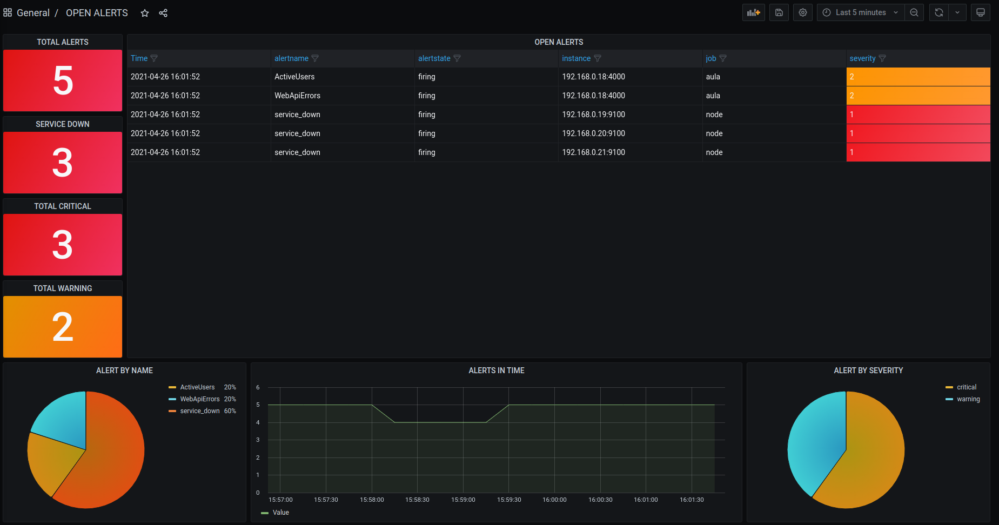

# Example Prometheus monitoring

This is a collection of studies about monitoring, aka Prometheus + Grafana + Alertmanager.

There is a sample nodejs app getting app  metrics.

## Running local Environment

usage:

```bash
docker-compose up -d
```

## Node exporter

To monitor Linux hosts, install node_exports on target.

Download desired version:

```bash
wget https://github.com/prometheus/node_exporter/releases/download/v1.1.2/node_exporter-1.1.2.linux-amd64.tar.gz
```

Untar and Run

```bash
tar -xvfz node_exporter-1.1.2.linux-amd64.tar.gz
cd node_exporter-1.1.2.linux-amd64.tar.gz
./node_exporter &
```

## Grafana Dashboard

Import the alert dashboard located in folder ./grafana-data/dashboards/



## Prometheus Configs

There is some fake Linux hosts  on prometheus.yaml to generate service_down alerts.

```yaml
- job_name: node
  honor_timestamps: true
  scrape_interval: 30s
  scrape_timeout: 10s
  metrics_path: /metrics
  scheme: http
  static_configs:
  - targets:
    - 192.168.0.18:9100
    - 192.168.0.19:9100
    - 192.168.0.20:9100
    - 192.168.0.21:9100
```
When you add node_exporter to some server, just add in this section.

## Pagerduty integration

To setup Pagerdutty[https://pagerduty.com/] integration, you need to create a free tier account and generate an API Token.

In alertmanager.yaml, set a receiver to pagerduty:

```yaml
receivers:

- name: 'team-X-pager'
  pagerduty_configs:
  - service_key: APIKEY
```
More information in Pagerduty Documentation[https://www.pagerduty.com/docs/guides/prometheus-integration-guide/]